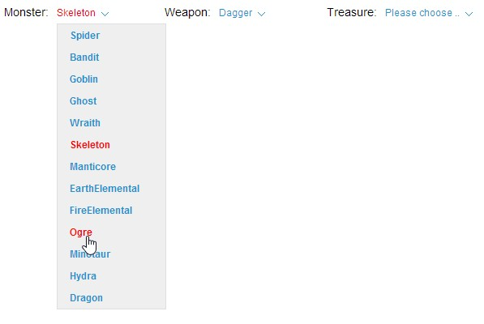

MVC .NET CSS Dropdown Menu
--------

Create a simple MVC C# ASP .NET CSS dropdown menu. The project includes HTML, CSS, Javascript and an easy MVC partial view to render custom css dropdown menus.



To include the dropdown menu in your view, you can use a partial view helper or the raw html. For example:

```
@Html.Partial("DropDownMenu", new DropDownMenu("lstMonsters") { Label = "Monster:", Items = UIManager.GetDropDownList(() => UIManager.GetEnumStrings<MonsterType>(), false) })
```

In the above example, the DropDownMenu class accepts an Id in the constructor, which is used for the select element's Id. DropDownMenu also includes the following properties:

Label: Text to display to the left of the dropdown menu (optional).
Items: List of SelectListItem, as you would typically provide to an MVC Html.DropDownList().

The dropdown menu includes an underlying HTML "select" element, which is kept in-sync with the values in the dropdown menu. This allows for easy management of the dropdown menus with javascript and jquery calls, for example:

```
$(document).ready(function () {
	// Automatically select an option in the dropdown.
	$('#lstMonsters').val(5);

	// Setup a change event for a dropdown.
	$('#lstMonsters').change(function () {
		$('#status').text('You selected ' + $(this).find(':selected').text() + '.');
	});
});
```

## Author

Kory Becker
http://www.primaryobjects.com/kory-becker.aspx


---
Copyright © 2014 Kory Becker (http://www.primaryobjects.com)

Permission is hereby granted, free of charge, to any person obtaining a copy of this software and associated documentation files (the "Software"), to deal in the Software without restriction, including without limitation the rights to use, copy, modify, merge, publish, distribute, sublicense, and/or sell copies of the Software, and to permit persons to whom the Software is furnished to do so, subject to the following conditions:

The above copyright notice and this permission notice shall be included in all copies or substantial portions of the Software.

THE SOFTWARE IS PROVIDED "AS IS", WITHOUT WARRANTY OF ANY KIND, EXPRESS OR IMPLIED, INCLUDING BUT NOT LIMITED TO THE WARRANTIES OF MERCHANTABILITY, FITNESS FOR A PARTICULAR PURPOSE AND NONINFRINGEMENT. IN NO EVENT SHALL THE AUTHORS OR COPYRIGHT HOLDERS BE LIABLE FOR ANY CLAIM, DAMAGES OR OTHER LIABILITY, WHETHER IN AN ACTION OF CONTRACT, TORT OR OTHERWISE, ARISING FROM, OUT OF OR IN CONNECTION WITH THE SOFTWARE OR THE USE OR OTHER DEALINGS IN THE SOFTWARE.